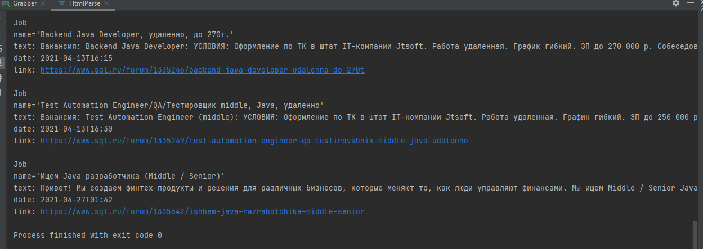
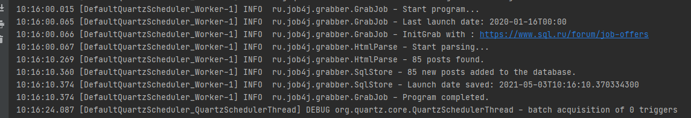

# job4j_grabber

#### Description of the project.
This project represents basic HTML grabber. The project is a job parser from the site sql.ru with recording them in the database and displaying them in an orderly manner in the console. The implementation is made so that the parser checks for updates after a specified period of time.

#### Functionality:
- Grabbing programmer vacancies from sql.ru
- CRUD operations for vacancies
- Loading the HTML page with vacancies using simple HTTP Server

#### Settings
- JDBC connection detail
- Run intervals
- parsing address data for connecting to the database are set in the configuration file - grabber.properties.

#### Used technologies
- JSOUP for parsing
- liquibase for create schemas  
- JDBC for manipulating with DB(Postgres)
- Quartz library for scheduling 
- Slf4j for logging
- Junit for Testing
- travic
- jacoco
- maven

#### output to the console of the found vacancies:

#### starting the Scheduler

#### Contacts
Telegram: https://t.me/dmtriiii